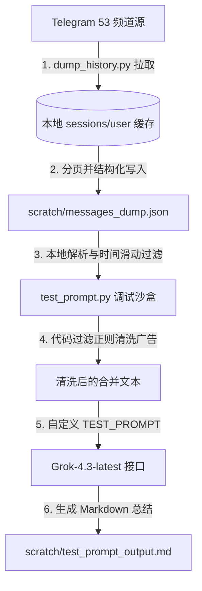

# P1-TelegramForwarder历史数据下载与Prompt本地调试方案

## 一、 方案背景与目标
在当前多通道消息转发与 AI 定时总结的运行体系下，直接对实时链路调试 AI Prompt 面临以下三个核心瓶颈：
1. **Telegram 频控机制严格**：频繁拉取 53 个频道的实时消息极易触发电报官方流量限制（`FloodWaitLimit`），从而导致会话文件被锁或用户账号限流。
2. **调试反馈时间长**：每次微调 Prompt 并测试都需要经过网络握手与消息流分页拉取，单次迭代需等待 1 到 5 分钟。
3. **AI 总结偏向 MEME 币**：当前的定时总结策略容易受频道内高频喊单、引流推广、情绪化 MEME 内容的噪音干扰，总结精度不足，偏离了技术型/硬核的 Alpha 机会的抓取。

本方案旨在通过**“历史数据结构化落盘”**与**“Prompt 本地调试沙盒”**双层架构，实现安全、零延迟、免网络且高保真的 Prompt 微调与噪音过滤环境。

---

## 二、 方案架构设计

整体方案由数据持久层、逻辑清洗层和沙盒调试层组成，实现解耦：



### 1. 数据持久层 (dump_history.py)
* **任务逻辑**：通过加载 `.env` 鉴权信息启动 `user_client`，遍历 53 个电报频道的链接，使用 `client.iter_messages` 逆向时间轴拉取过去 30 天产生的全部文本消息。
* **安全性保证**：
  * 在拉取每一路通道之间配置 1.0 秒休眠，以平滑请求速率。
  * 自动捕获 `errors.FloodWaitError`，在触发频控时自动挂起并精准等待对应秒数后自动重试。
  * **增量存盘机制**：每完成一个频道的全量 30 天拉取，即时序列化并持久化保存到 JSON 文本中。即使中途断网或异常中断，已抓取的数据依然安全存盘，支持下一次运行跳过。
* **数据库解耦**：本工具不写回转发关联 SQLite 库，只读 `chats` 表或使用硬编码 fallback 链接，确保不会脏写数据库运行状态。

### 2. 沙盒调试层 (test_prompt.py)
* **任务逻辑**：脱离 Telegram 客户端网络环境运行。脚本启动时直接加载本地 JSON 数据。
* **滑动时间窗口**：支持在脚本顶端修改 `TEST_DAYS` 变量（如 1、3、7 天），脚本将根据 ISO 时间戳自动截取特定时间段的消息用于 AI 输入。
* **高频迭代**：每次修改 Prompt 并运行，仅消耗大模型 API 调用时间（通常为 1-2 秒），从而实现了本地 Prompt 策略调优的快速闭环。

---

## 三、 本地数据模型 (JSON Schema)

抓取的历史数据统一存储在项目根目录的 `scratch/messages_dump.json` 中，其数据结构定义如下：

```json
{
  "https://t.me/channel_link": {
    "channel_name": "频道标题/显示名称",
    "channel_id": 123456789,
    "messages": [
      {
        "id": 1054,
        "date": "2026-06-08T13:54:12+08:00",
        "text": "这是消息的正文内容文本"
      }
    ]
  }
}
```

---

## 四、 本地清洗与 Prompt 调优策略

为了纠正 AI 总结中 MEME 偏向的问题，在本地沙盒环境中主要实施以下两层调优：

### 1. 代码级数据过滤与兼容处理
在拉取和解析数据时，脚本对以下已知问题做出了特殊兼容：
* **会话冲突与锁定**：由于 Telethon Session (`sessions/user.session`) 的独占性锁机制，在运行 `dump_history.py` 离线抓取脚本前，**必须手动终止正在运行的实时转发守护进程 `main.py`**，拉取完成后方可重启守护进程，否则将抛出数据库锁定异常。
* **限制转发频道拦截**：部分源频道开启了内容保护（禁止转发），直接转发会触发 `ChatForwardsRestrictedError`。在 `dump_history.py` 中，采用基于文本内容导出的方案避开了此限制。
* **服务消息异常**：部分频道内含有 `MessageService`（如置顶消息、群组升级等系统事件通知），这些消息不具备普通消息的转发属性。脚本在遍历时过滤并跳过了此类非文本消息。

### 2. AI Prompt 结构重构 (Prompt Refinement)
在 `test_prompt.py` 的 `TEST_PROMPT` 中，通过设定严格的角色限定和约束规则：
* **限定主体范围**：显式声明排他性规则（“拒绝 MEME 币刷屏偏向，限制 MEME 的版面，重点提炼基础设施公链进展、新 DeFi、大额融资项目”）。
* **格式约束**：强制输出标准字段，如 `代币简称`、`项目亮点`、`合约地址`、`VC投资走向` 等。

---

## 五、 操作使用指南

### 1. 30天全量数据下载
当需要下载或更新 30 天历史数据时，请先确保实时转发进程已暂停以释放 sqlite 会话锁，然后在控制台运行：
```powershell
.\venv\Scripts\python dump_history.py
```
*运行结果将生成并更新 [messages_dump.json](file:///D:/Axiangmu/TelegramForwarder/scratch/messages_dump.json)*

### 2. 本地 Prompt 调优迭代
打开并修改 `test_prompt.py` 中的 `TEST_PROMPT` 和 `TEST_DAYS` 后运行：
```powershell
.\venv\Scripts\python test_prompt.py
```
*总结结果会实时写入到本地 Markdown 报告中，可通过 Markdown 渲染器或文本编辑器直接双击打开查看效果：*
[test_prompt_output.md](file:///D:/Axiangmu/TelegramForwarder/scratch/test_prompt_output.md)
