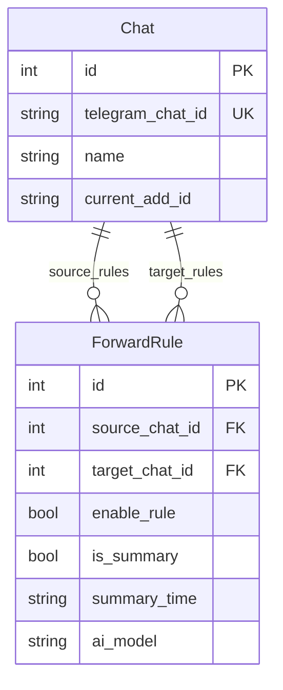

# P9 — 前端 TG 频道/规则管理功能设计

## 背景

当前添加和删除频道只能通过 Telegram Bot 命令（`/bind`、`/delete_rule`）操作，前端没有任何独立的频道管理和解析入口。用户在需要添加、改名、删除频道时体验割裂。因此，需要在前端后台管理系统中，增加一个独立的 **"TG 管理"** 页面，实现频道与群组的统一维护。

---

## 现状分析

### 1. 数据模型



- **Chat 模型**不区分群组/频道/私聊，没有 `type` 字段。
- **关联依赖**：Chat 记录可能作为 `source_chat_id` 或 `target_chat_id` 被 `ForwardRule` 引用。

### 2. 核心难点：跨进程 Telegram API 调用

> [!WARNING]
> **主/子进程隔离问题**
> 
> Telethon 客户端 `user_client` 运行在 `main.py` 的主进程中。而前端控制台 API 由运行在独立子进程中的 RSS 服务（FastAPI）提供。
> 
> 由于 Telegram 会话数据库文件被主进程独占锁定，子进程无法直接实例化 `TelegramClient` 进行链接/用户名解析。

**解决方案选型：本地 HTTP 桥接 (Local HTTP Bridge)**
- 在主进程中利用已有的 `aiohttp` 依赖，在 `127.0.0.1:8001`（或配置的内部端口）启动一个极简的内部 HTTP 服务。
- 当 RSS 子进程收到解析请求时，向主进程发起本地 HTTP 请求，由主进程的 `user_client` 完成解析后返回。

---

## 架构设计

### 1. 本地 HTTP 桥接数据流

```
┌──────────────┐          POST /api/chats/resolve         ┌──────────────┐
│  React 前端  │ ───────────────────────────────────────> │  RSS 子进程  │
└──────────────┘                                          └──────────────┘
       ▲                                                          │
       │ 返回解析后的 Chat 记录                                   │ POST http://127.0.0.1:8001/resolve
       │                                                          ▼
┌──────────────┐         get_entity(link)                 ┌──────────────┐
│  数据库/更新 │ <─────────────────────────────────────── │  主进程      │
└──────────────┘                                          └──────────────┘
```

---

## 后端详细设计

### 1. 主进程：内部解析服务 [MODIFY] [main.py](file:///D:/Axiangmu/TelegramForwarder/main.py)

在 `start_clients` 中启动一个内部 aiohttp 服务器，对外提供 `/resolve` 接口：

```python
from aiohttp import web

async def start_internal_server(user_client):
    app = web.Application()
    
    async def resolve_handler(request):
        try:
            data = await request.json()
            link = data.get("link")
            if not link:
                return web.json_response({"status": "error", "message": "参数 link 不能为空"}, status=400)
            
            # 使用主进程的 user_client 解析实体
            entity = await user_client.get_entity(link)
            
            return web.json_response({
                "status": "success",
                "telegram_chat_id": str(entity.id),
                "name": entity.title if hasattr(entity, 'title') else (
                    f"{entity.first_name} {entity.last_name}" if hasattr(entity, 'last_name') and entity.last_name 
                    else entity.first_name if hasattr(entity, 'first_name') else "Private Chat"
                )
            })
        except Exception as e:
            return web.json_response({"status": "error", "message": str(e)}, status=500)
            
    app.router.add_post("/resolve", resolve_handler)
    runner = web.AppRunner(app)
    await runner.setup()
    site = web.TCPSite(runner, '127.0.0.1', 8001)
    await site.start()
    logger.info("内部解析桥接服务已启动在 127.0.0.1:8001")
```

### 2. 子进程：API 路由设计 [MODIFY] [console.py](file:///D:/Axiangmu/TelegramForwarder/rss/app/routes/console.py)

#### 2.1 `GET /api/chats` (增加关联规则统计)
```python
@router.get("/chats")
async def get_chats(user=Depends(get_current_user)):
    require_auth(user)
    db = get_session()
    try:
        chats = db.query(Chat).all()
        result = []
        for c in chats:
            # 统计被引用次数
            source_rule_count = db.query(ForwardRule).filter(ForwardRule.source_chat_id == c.id).count()
            target_rule_count = db.query(ForwardRule).filter(ForwardRule.target_chat_id == c.id).count()
            result.append({
                "id": c.id,
                "telegram_chat_id": c.telegram_chat_id,
                "name": c.name,
                "source_rule_count": source_rule_count,
                "target_rule_count": target_rule_count
            })
        return result
    finally:
        db.close()
```

#### 2.2 `PUT /api/chats/{id}` (修改频道名称)
```python
@router.put("/chats/{id}")
async def update_chat(id: int, data: Dict, user=Depends(get_current_user)):
    require_auth(user)
    name = data.get("name")
    if not name:
        raise HTTPException(status_code=400, detail="名称不能为空")
    db = get_session()
    try:
        chat = db.query(Chat).filter(Chat.id == id).first()
        if not chat:
            raise HTTPException(status_code=404, detail="Chat 记录不存在")
        chat.name = name
        db.commit()
        return {"status": "success"}
    except Exception as e:
        db.rollback()
        raise HTTPException(status_code=400, detail=str(e))
    finally:
        db.close()
```

#### 2.3 `DELETE /api/chats/{id}` (安全删除频道)
```python
@router.delete("/chats/{id}")
async def delete_chat(id: int, user=Depends(get_current_user)):
    require_auth(user)
    db = get_session()
    try:
        # 检查是否被规则引用
        has_ref = db.query(ForwardRule).filter(
            (ForwardRule.source_chat_id == id) | (ForwardRule.target_chat_id == id)
        ).first()
        if has_ref:
            raise HTTPException(status_code=400, detail="该频道已被转发规则引用，无法删除")
            
        chat = db.query(Chat).filter(Chat.id == id).first()
        if not chat:
            raise HTTPException(status_code=404, detail="Chat 记录不存在")
        db.delete(chat)
        db.commit()
        return {"status": "success"}
    except HTTPException:
        raise
    except Exception as e:
        db.rollback()
        raise HTTPException(status_code=400, detail=str(e))
    finally:
        db.close()
```

#### 2.4 `POST /api/chats/resolve` (解析并自动注册 Chat)
```python
import httpx

@router.post("/chats/resolve")
async def resolve_chat(data: Dict, user=Depends(get_current_user)):
    require_auth(user)
    link = data.get("link")
    if not link:
        raise HTTPException(status_code=400, detail="解析链接或用户名不能为空")
    
    # 转发请求到主进程内部服务
    try:
        async with httpx.AsyncClient() as client:
            response = await client.post("http://127.0.0.1:8001/resolve", json={"link": link}, timeout=10.0)
            if response.status_code != 200:
                raise HTTPException(status_code=response.status_code, detail=response.json().get("message", "解析失败"))
            res_data = response.json()
    except Exception as e:
        raise HTTPException(status_code=500, detail=f"内部解析服务通信失败: {str(e)}")
        
    # 保存或更新到数据库
    db = get_session()
    try:
        telegram_chat_id = res_data.get("telegram_chat_id")
        name = res_data.get("name")
        
        chat = db.query(Chat).filter(Chat.telegram_chat_id == telegram_chat_id).first()
        if not chat:
            chat = Chat(telegram_chat_id=telegram_chat_id, name=name)
            db.add(chat)
            db.commit()
            db.refresh(chat)
        else:
            # 如果名称有变化，进行同步更新
            if chat.name != name:
                chat.name = name
                db.commit()
                db.refresh(chat)
                
        return {
            "status": "success",
            "chat": {
                "id": chat.id,
                "telegram_chat_id": chat.telegram_chat_id,
                "name": chat.name
            }
        }
    finally:
        db.close()
```

---

## 前端详细设计

### 1. 路由与菜单配置 [MODIFY] [App.tsx](file:///D:/Axiangmu/TelegramForwarder/frontend/src/App.tsx)

1. 在 `TABS` 中增加 "TG 管理" 项：
   ```typescript
   import { Send } from 'lucide-react' // 使用 Send 作为 Telegram 纸飞机图标
   
   const TABS: TabDef[] = [
     { id: 'rules', label: '规则设置', icon: <Settings size={16} /> },
     { id: 'tg', label: 'TG 管理', icon: <Send size={16} /> }, // 新增 Tab
     { id: 'rss', label: 'RSS 管理', icon: <Rss size={16} /> },
     { id: 'ai', label: 'AI 沙盒', icon: <Cpu size={16} /> },
     { id: 'monitor', label: '运维监控', icon: <Activity size={16} /> },
   ]
   ```
2. 主内容区渲染新增组件：
   ```typescript
   {activeTab === 'tg' && <TgPage />}
   ```

### 2. 前端 API 对接 [MODIFY] [api.ts](file:///D:/Axiangmu/TelegramForwarder/frontend/src/api.ts)

```typescript
export interface ChatDetail extends Chat {
  source_rule_count: number
  target_rule_count: number
}

export const chatsApi = {
  getAll: () => api.get<ChatDetail[]>('/chats').then(r => r.data),
  update: (id: number, name: string) => api.put(`/chats/${id}`, { name }),
  delete: (id: number) => api.delete(`/chats/${id}`),
  resolve: (link: string) => api.post<{ status: string; chat: Chat }>('/chats/resolve', { link }).then(r => r.data),
}
```

### 3. TG 管理页面 UI 实现 [NEW] [TgPage.tsx](file:///D:/Axiangmu/TelegramForwarder/frontend/src/pages/TgPage.tsx)

页面采用现代化玻璃拟态（glassmorphism）风格设计，响应式布局：

- **搜索与添加区域**：
  - 左侧：搜索过滤输入框。
  - 右侧：`[+ 解析绑定新频道]` 按钮。
- **列表区域**：
  - 数据表格展示：ID、Telegram ID、频道名（支持行内双击编辑）、使用状态、操作。
  - 状态标签渲染：
    - 作为源频道：`🟢 源 (X条规则)`
    - 作为目标频道：`🔵 目标 (Y条规则)`
    - 闲置：`🟡 闲置`（可安全清理）
  - 操作栏：
    - `编辑` 按钮：弹出重命名对话框。
    - `删除` 按钮：若有关联规则则置灰禁用并显示 tooltip 提示，闲置则允许删除并显示二次确认弹窗。
- **解析弹窗 (Resolve Modal)**：
  - 输入框提示：支持输入如 `@durov`、`https://t.me/durov`。
  - 异步解析状态展示（包含 Loading 态和错误态提示）。

### 4. 规则设置页面 UI 增强 [MODIFY] [RulesPage.tsx](file:///D:/Axiangmu/TelegramForwarder/frontend/src/pages/RulesPage.tsx)

1. **新建转发规则入口**：
   - 规则列表顶部新增 `[新建]` 按钮。
   - 点击打开 Radix Dialog 弹窗，加载所有已绑定的 `chats`。
   - 选择“源频道”（必选）与“目标群组”（必选，自动匹配名为 `2026` 的群组作为默认值）。
   - 确认后调用 `rulesApi.create` 创建规则，成功后刷新规则列表并自动高亮选中新规则。
   - 重复规则校验：如果创建时抛出重复规则异常，展示友好提示。

2. **删除转发规则入口**：
   - 规则列表项右侧悬浮显示 `[🗑️]` 删除按钮（仅在鼠标悬浮时显示，见 App.css 优化）。
   - 点击弹出二次确认，调用 `rulesApi.delete` 删除规则，成功后自动清除右侧配置并重选其它规则。

### 5. 全局 CSS 补充 [MODIFY] [App.css](file:///D:/Axiangmu/TelegramForwarder/frontend/src/App.css)

在 `App.css` 中追加悬浮显示样式，使删除按钮不常态占用侧边栏位置，实现 premium 精细质感：
```css
.rule-list-item .delete-rule-btn {
  opacity: 0;
  transition: opacity var(--transition-fast);
}
.rule-list-item:hover .delete-rule-btn {
  opacity: 0.6;
}
.rule-list-item:hover .delete-rule-btn:hover {
  opacity: 1;
  color: var(--color-danger);
}
```

---

## 验证计划

1. **测试用例 1：解析合法公开频道**
   - 操作：在弹窗内输入 `https://t.me/telegram` 并点击解析。
   - 预期：展示解析中状态，1-2秒后解析成功，自动在列表中新增该频道并关闭弹窗。

2. **测试用例 2：重命名频道**
   - 操作：选择一个频道，点击编辑，输入新名称并提交。
   - 预期：API 返回成功，前端列表及转发规则页面下拉菜单内该频道名称同步更新。

3. **测试用例 3：删除被引用频道拦截**
   - 操作：选择一个已被规则引用的频道，悬浮或点击删除。
   - 预期：删除按钮置灰不可点击，或点击后提示“该频道已被转发规则引用，无法删除”。

4. **测试用例 4：删除闲置频道**
   - 操作：选择一个闲置频道，点击删除，并在弹窗内确认。
   - 预期：删除成功，列表刷新，且不影响其它数据。
